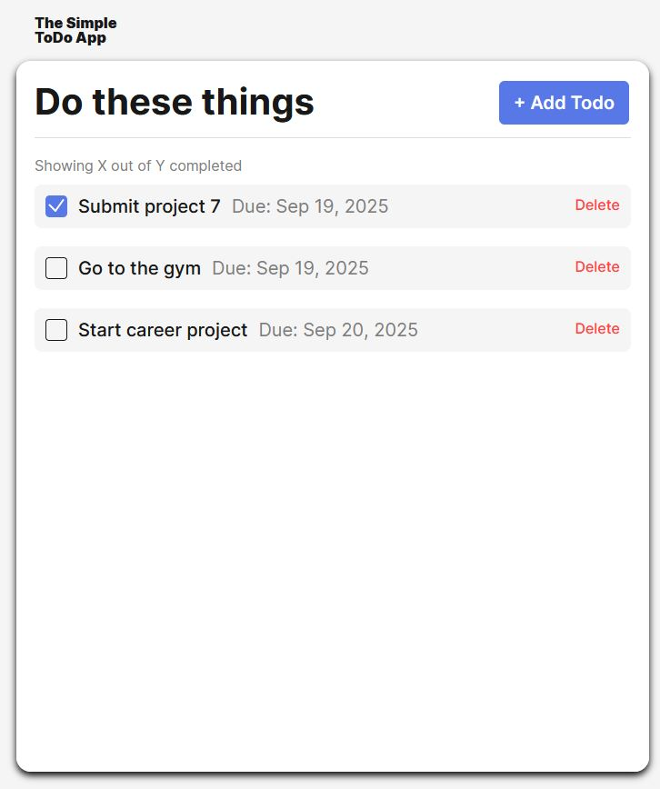
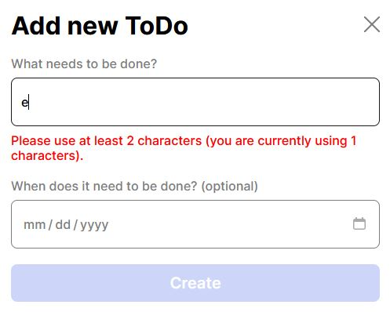
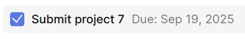
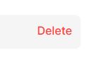

# Simple Todo App

The Simple Todo App is an interactive easy to use app that allows users to create new to-do tasks and add them to a list format. Users simply enter the task name (what needs to be done) and can even set a due date for each task as well (optional). Lastly, users can then check off completed tasks and delete them as needed.

## Functionality

When users add a new task they are prompted to enter what needs to get done and optionally, a due date. At the time that a user opens the form, the "Create" button remains disabled, and only becomes enabled after each input field "passes" validation. For example, entering at least 2 characters into the task field is the requirement for passing validation and only then will the button become enabled. Furthermore, users can close the form and come back to the same slate. When a user successfully submits a new task the fields will automatically reset.

## Technology

- HTML: Used to structure the app.
- CSS: Used to style elements on the page.
- Javascript: Used to manipulate app behavior using the DOM.

In Javascript, classes and modules were created in order to factor out unique functionality across the javascript files. The FormValidator.js file validates user input data while the Todo.js creates a new task. Data is imported and exported as necessary between these files and index.js.

**The Simple Todo App:**

Users can add a new task by cliking on the + New Todo button.
A form will pop up. Input data will be validated in real-time.

Users can check off tasks when completed:

Users can delete tasks as needed:

## Plan on improving project

- Adding some CSS style to make it more interesting!

## Deployment

This project is deployed on GitHub Pages:

- https://ihekusmiles.github.io/se_project_todo-app/
